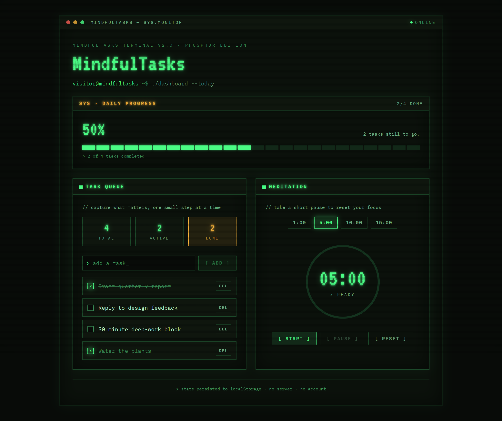

# MindfulTasks — 1980s CRT terminal re-skin

## Summary

A visual redesign of MindfulTasks into a cohesive 1980s CRT / phosphor-terminal
interface. **No functionality changed** — the todo list, meditation timer, and
`localStorage` persistence work exactly as before. This is styling only, plus a
terminal "window" wrapper around the existing dashboard.

- **Base branch:** `main`
- **This branch:** `feature/mindfultasks-crt-theme`

## What changed

### Theme foundation
- `tailwind.config.js` — replaced the `sage` palette with a `term` palette
  (phosphor green `#4dff88`, amber `#ffb63d`, dark screen `#080b08`, etc.);
  added `font-mono` (IBM Plex Mono) and `font-display` (VT323) families and
  terminal glow shadows.
- `src/index.css` — terminal web fonts; dark screen background; `.text-glow`
  phosphor text-shadow helpers; a blinking cursor helper; and a fixed
  `.crt-overlay` (scanlines + vignette + slow drift) with a subtle screen
  flicker. All animation is disabled under `prefers-reduced-motion`.
- `index.html` — added `theme-color` meta so the browser chrome matches.

### Components (styling / presentation only)
- `Dashboard.tsx` — wraps the dashboard in a terminal window with a title bar
  (`● ● ●  mindfultasks — sys.monitor … online`) and a shell-prompt header.
  Grid, breakpoints and all props/handlers are unchanged.
- `Card.tsx` — panels are now sharp-edged terminal boxes with an uppercase
  header bar; subtitles render as `// comments`.
- `ProgressBanner.tsx` — the bar is now a 24-segment LED-style gauge; added
  `role="progressbar"` for accessibility. Percentage / message logic unchanged.
- `StatCard.tsx` — bordered readouts with big VT323 numerals; `accent` → amber.
- `TodoInput.tsx` — framed input with a `>` prompt; button reads `[ Add ]`.
- `TodoItem.tsx` — `appearance-none` checkbox styled as a terminal `[x]` box;
  delete button reads `Del`. `onToggle` / `onDelete` / `aria-label` untouched.
- `MeditationSection.tsx` — green glowing progress ring, VT323 countdown,
  `[ Start ] [ Pause ] [ Reset ]` buttons, amber completion banner. The
  `"Meditation complete"` text, timer math, and disabled logic are unchanged.

### Not touched
`src/hooks/*`, `src/types.ts`, `src/App.tsx`, `vite.config.ts`, `package.json` —
no logic, state, storage, or dependency changes.

## How it was tested

- **Production build:** `npm run build` (`tsc -b && vite build`) — passes, no
  type or build errors.
- **Local dev server**, manual verification:
  - Added a task, toggled tasks complete/incomplete, deleted a task — counts and
    the progress gauge update correctly.
  - Reloaded the page — tasks and their completed state persist from
    `localStorage`.
  - Meditation timer: selected 1:00, Start counts down, Pause freezes the value,
    Reset returns to the selected duration; ran a full 1:00 cycle to `00:00` and
    saw the `>> Meditation complete` banner, then Reset cleared it.
  - No console errors on load or during interaction.
  - Checked layouts at mobile (375px) and desktop widths — both remain usable.

## Screenshot

## Notes
- Not merged, not deployed — for review only.
